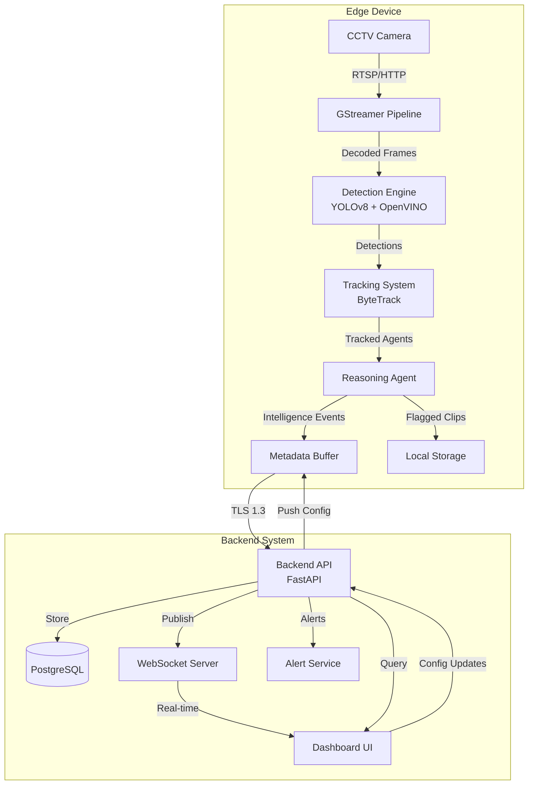

# Design Document: Smart Edge AI CCTV System

## Overview

The Smart Edge AI CCTV system is architected as a distributed edge-cloud platform with two primary components:

1. **Edge Processing Layer**: Deployed on Intel i5 CPU-only devices at surveillance locations, responsible for video ingestion, real-time object detection, multi-object tracking, and behavioral reasoning
2. **Backend Cloud Layer**: Centralized FastAPI-based service providing dashboard visualization, event management, zone configuration, and alerting

The system prioritizes privacy-by-design through local processing, transmitting only structured metadata to the backend. The architecture is optimized for CPU-only inference using Intel OpenVINO, enabling cost-effective deployment across diverse Indian infrastructure.

## Architecture

### System Architecture Diagram



### Component Interaction Flow

1. **Video Ingestion**: GStreamer receives RTSP/HTTP streams from cameras and decodes frames
2. **Detection**: Each frame passes through YOLOv8 ONNX model optimized with OpenVINO
3. **Tracking**: ByteTrack associates detections across frames, maintaining agent identities
4. **Reasoning**: Behavioral analysis engine processes tracked agents against zone rules and temporal patterns
5. **Event Generation**: Intelligence events are created with severity, confidence, and reasoning
6. **Transmission**: Metadata is encrypted and transmitted to backend; flagged clips stored locally
7. **Visualization**: Backend serves dashboard with real-time events and historical search
8. **Configuration**: Zone and policy updates flow from backend to edge devices

## Components and Interfaces

### 1. Video Ingestion Module (GStreamer)

**Responsibility**: Capture and decode video streams from CCTV cameras

**Technology Stack**:
- GStreamer 1.20+ with Python bindings (PyGObject)
- Supported protocols: RTSP, HTTP, file input
- Codecs: H.264, H.265

**Interface**:
```python
class VideoIngestionModule:
    def initialize(camera_config: CameraConfig) -> bool
    def start_stream() -> None
    def get_frame() -> Optional[Frame]
    def stop_stream() -> None
    def get_stream_status() -> StreamStatus
```

**Key Design Decisions**:
- Use GStreamer's `appsink` element to extract frames as numpy arrays
- Implement frame dropping when processing cannot keep up (maintain real-time)
- Automatic reconnection with exponential backoff (1s, 2s, 4s, max 30s)
- Frame buffer size: 5 frames maximum to prevent memory bloat

### 2. Detection Engine (YOLOv8 + OpenVINO)

**Responsibility**: Detect people, hands, bags, and tools in video frames

**Technology Stack**:
- YOLOv8n (nano) or YOLOv8s (small) exported to ONNX format
- Intel OpenVINO Runtime 2023.0+
- Model optimization: INT8 quantization for CPU inference

**Interface**:
```python
class DetectionEngine:
    def initialize(model_path: str, device: str = "CPU") -> None
    def detect(frame: Frame) -> List[Detection]
    def get_performance_metrics() -> PerformanceMetrics

class Detection:
    bbox: BoundingBox  # (x1, y1, x2, y2)
    class_id: int  # 0: person, 1: hand, 2: bag, 3: tool
    confidence: float
    class_name: str
```

**Key Design Decisions**:
- Input resolution: 640x640 (YOLOv8 default) with letterboxing
- Confidence threshold: 0.5 for all classes
- NMS (Non-Maximum Suppression) threshold: 0.45
- OpenVINO device: CPU with AUTO plugin for optimal thread allocation
- Model loading: Compile model once at startup, reuse inference requests
- Preprocessing: Normalize to [0, 1], convert BGR to RGB

**Performance Optimization**:
- Use OpenVINO async inference API for pipelining
- Batch size: 1 (real-time processing)
- Enable CPU streams for parallel execution
- Target: <100ms inference time on Intel i5

### 3. Tracking System (ByteTrack)

**Responsibility**: Maintain consistent identities for detected objects across frames

**Technology Stack**:
- ByteTrack algorithm implementation
- Kalman filter for motion prediction
- IoU (Intersection over Union) for association

**Interface**:
```python
class TrackingSystem:
    def update(detections: List[Detection], frame_id: int) -> List[Track]
    def get_active_tracks() -> List[Track]
    def reset() -> None

class Track:
    track_id: int
    bbox: BoundingBox
    class_id: int
    confidence: float
    age: int  # frames since first detection
    time_since_update: int  # frames since last detection
    state: TrackState  # TENTATIVE, CONFIRMED, LOST
```

**Key Design Decisions**:
- Track retention: 30 frames (2 seconds at 15 FPS)
- Confirmation threshold: 3 consecutive detections
- IoU threshold for association: 0.3
- Kalman filter: Constant velocity model
- Handle occlusions: Predict positions for up to 10 frames
- Track ID assignment: Monotonically increasing integers per camera

**ByteTrack Specifics**:
- Two-stage association: high-confidence detections first, then low-confidence
- High confidence threshold: 0.6
- Low confidence threshold: 0.3

### 4. Reasoning Agent

**Responsibility**: Interpret behavioral patterns and generate intelligence events

**Architecture**:
```python
class ReasoningAgent:
    def __init__(zone_config: ZoneConfig, policy_config: PolicyConfig)
    def process_tracks(tracks: List[Track], timestamp: float) -> List[IntelligenceEvent]
    def update_configuration(zone_config: ZoneConfig, policy_config: PolicyConfig) -> None

class BehaviorAnalyzer:
    def analyze_dwell(track: Track, zones: List[Zone]) -> Optional[DwellEvent]
    def analyze_motion_pattern(track: Track) -> Optional[MotionEvent]
    def analyze_zone_violation(track: Track, zones: List[Zone]) -> Optional[ViolationEvent]
    def analyze_object_state(tracks: List[Track]) -> Optional[StateChangeEvent]
    def analyze_after_hours(tracks: List[Track], current_time: datetime) -> Optional[AfterHoursEvent]
```

**Behavioral Analysis Modules**:

1. **Dwell Duration Monitor**:
   - Track agent positions within zones over time
   - Calculate cumulative dwell time per zone per agent
   - Trigger events when threshold exceeded
   - Data structure: `Dict[track_id, Dict[zone_id, dwell_start_time]]`

2. **Motion Pattern Analyzer**:
   - Calculate velocity vectors between frames
   - Detect rapid directional changes (>3 per second)
   - Identify counter-flow movement
   - Track trajectory history (last 30 positions)

3. **Zone Violation Detector**:
   - Check if agent bounding box intersects restricted zones
   - Immediate event generation for restricted zone entry
   - Support for time-based zone restrictions

4. **Object State Monitor**:
   - Track bag objects and their associated person tracks
   - Detect when bag becomes stationary while person moves away
   - Unattended object threshold: 10 seconds

5. **After-Hours Monitor**:
   - Compare current time against configured business hours
   - Generate high-severity events for any movement outside hours

6. **Abnormal Activity Detector**:
   - Crowd detection: Count agents per zone
   - Stationary detection: Agent velocity < threshold for > duration
   - Tool detection in restricted zones

**Event Severity Scoring**:
- Restricted zone violation: 8-10 (high)
- After-hours movement: 7-9 (high)
- Unattended object: 6-8 (medium-high)
- Abnormal motion: 5-7 (medium)
- Excessive dwell: 4-6 (medium)
- Crowd formation: 3-5 (low-medium)

**Confidence Calculation**:
- Base confidence from detection confidence
- Adjust based on track age (older tracks = higher confidence)
- Adjust based on observation duration (longer = higher confidence)
- Formula: `confidence = detection_conf * min(1.0, track_age / 30) * min(1.0, observation_duration / 5)`

### 5. Metadata Buffer and Transmission

**Responsibility**: Buffer events locally and transmit to backend securely

**Interface**:
```python
class MetadataBuffer:
    def add_event(event: IntelligenceEvent) -> None
    def get_pending_events() -> List[IntelligenceEvent]
    def mark_transmitted(event_ids: List[str]) -> None
    def get_buffer_size() -> int

class MetadataTransmitter:
    def initialize(backend_url: str, device_token: str) -> None
    def transmit_events(events: List[IntelligenceEvent]) -> TransmitResult
    def check_connection() -> bool
```

**Key Design Decisions**:
- Buffer capacity: 1 hour of events (estimated 3600 events at 1 event/second worst case)
- Transmission batch size: 10 events per request
- Transmission interval: Every 5 seconds or when buffer reaches 50 events
- Retry logic: Exponential backoff with max 5 retries
- Persistence: SQLite database for buffer durability across restarts
- Encryption: TLS 1.3 for all HTTP communication

### 6. Local Storage for Flagged Clips

**Responsibility**: Store short video clips associated with high-severity events

**Interface**:
```python
class ClipStorage:
    def save_clip(event_id: str, frames: List[Frame], duration: float) -> str
    def get_clip(event_id: str) -> Optional[VideoClip]
    def cleanup_old_clips(retention_days: int = 7) -> int
    def get_storage_usage() -> StorageMetrics
```

**Key Design Decisions**:
- Clip duration: 10 seconds (5 seconds before event, 5 seconds after)
- Storage format: MP4 with H.264 encoding
- Retention: 7 days, automatic cleanup
- Storage limit: 50 GB per edge device
- Naming: `{event_id}_{timestamp}.mp4`
- Only save clips for events with severity >= 7

### 7. Backend API (FastAPI)

**Responsibility**: Receive metadata, serve dashboard, manage configuration

**Technology Stack**:
- FastAPI 0.100+
- PostgreSQL 14+ for event storage
- Redis for caching and real-time pub/sub
- WebSocket for real-time dashboard updates

**API Endpoints**:

```python
# Event ingestion
POST /api/v1/events/ingest
    Body: List[IntelligenceEvent]
    Auth: Device token
    Response: IngestResult

# Event retrieval
GET /api/v1/events/search
    Query: start_date, end_date, severity_min, zone_id, event_type
    Auth: JWT
    Response: List[IntelligenceEvent]

GET /api/v1/events/{event_id}
    Auth: JWT
    Response: IntelligenceEvent

# Device management
POST /api/v1/devices/register
    Body: DeviceRegistration
    Auth: Admin JWT
    Response: DeviceCredentials

GET /api/v1/devices
    Auth: JWT
    Response: List[Device]

GET /api/v1/devices/{device_id}/health
    Auth: JWT
    Response: DeviceHealth

# Zone configuration
POST /api/v1/zones
    Body: ZoneConfig
    Auth: Admin JWT
    Response: Zone

PUT /api/v1/zones/{zone_id}
    Body: ZoneConfig
    Auth: Admin JWT
    Response: Zone

GET /api/v1/zones
    Query: device_id
    Auth: JWT
    Response: List[Zone]

# Authentication
POST /api/v1/auth/login
    Body: Credentials
    Response: JWTToken

POST /api/v1/auth/refresh
    Body: RefreshToken
    Response: JWTToken

# Real-time updates
WS /api/v1/events/stream
    Auth: JWT
    Messages: IntelligenceEvent (server -> client)
```

**Key Design Decisions**:
- Database: PostgreSQL with TimescaleDB extension for time-series optimization
- Indexing: Composite indexes on (timestamp, severity), (device_id, timestamp)
- Caching: Redis for zone configurations (TTL: 5 minutes)
- Rate limiting: 100 requests/minute per device for ingestion
- Pagination: 50 events per page for search results
- WebSocket: Broadcast events with severity >= 6 to connected clients

### 8. Authentication and Authorization

**Security Architecture**:

```python
class AuthService:
    def authenticate_user(username: str, password: str) -> Optional[User]
    def generate_jwt(user: User) -> JWTToken
    def verify_jwt(token: str) -> Optional[User]
    def authenticate_device(device_token: str) -> Optional[Device]

class AuthorizationService:
    def check_permission(user: User, resource: str, action: str) -> bool
```

**Role-Based Access Control**:
- **Admin**: Full access (create/update/delete zones, devices, users)
- **Operator**: Read/write access to events, zones; read-only for devices
- **Viewer**: Read-only access to events and dashboard

**Key Design Decisions**:
- Password hashing: bcrypt with cost factor 12
- JWT expiration: 24 hours for users, 90 days for devices
- JWT claims: user_id, role, device_id (for devices)
- Device tokens: 256-bit random tokens, stored hashed in database
- API key rotation: Support for device token refresh without re-registration

## Data Models

### Core Data Structures

```python
@dataclass
class BoundingBox:
    x1: float  # Top-left x
    y1: float  # Top-left y
    x2: float  # Bottom-right x
    y2: float  # Bottom-right y
    
    def area() -> float
    def center() -> Tuple[float, float]
    def iou(other: BoundingBox) -> float

@dataclass
class Detection:
    bbox: BoundingBox
    class_id: int
    class_name: str
    confidence: float
    frame_id: int
    timestamp: float

@dataclass
class Track:
    track_id: int
    bbox: BoundingBox
    class_id: int
    class_name: str
    confidence: float
    age: int
    time_since_update: int
    state: TrackState
    velocity: Tuple[float, float]
    trajectory: List[Tuple[float, float]]  # Last 30 positions

@dataclass
class Zone:
    zone_id: str
    name: str
    polygon: List[Tuple[float, float]]  # Vertices
    zone_type: ZoneType  # NORMAL, RESTRICTED, MONITORING
    dwell_threshold: float  # seconds
    is_restricted: bool
    active_hours: Optional[TimeRange]
    camera_id: str

@dataclass
class IntelligenceEvent:
    event_id: str  # UUID
    timestamp: datetime
    device_id: str
    camera_id: str
    event_type: EventType
    severity: int  # 1-10
    confidence: float  # 0.0-1.0
    reasoning: str  # Explainable text
    zone_id: Optional[str]
    agent_ids: List[int]
    bounding_boxes: List[BoundingBox]
    metadata: Dict[str, Any]  # Additional context
    clip_available: bool

@dataclass
class DeviceHealth:
    device_id: str
    timestamp: datetime
    cpu_usage: float
    memory_usage: float
    frame_rate: float
    active_cameras: int
    events_buffered: int
    status: DeviceStatus  # ONLINE, DEGRADED, OFFLINE

@dataclass
class CameraConfig:
    camera_id: str
    name: str
    stream_url: str
    fps: int
    resolution: Tuple[int, int]
    zones: List[Zone]
```

### Database Schema (PostgreSQL)

```sql
-- Devices table
CREATE TABLE devices (
    device_id VARCHAR(64) PRIMARY KEY,
    name VARCHAR(255) NOT NULL,
    location VARCHAR(255),
    device_token_hash VARCHAR(255) NOT NULL,
    created_at TIMESTAMP NOT NULL,
    last_seen TIMESTAMP
);

-- Cameras table
CREATE TABLE cameras (
    camera_id VARCHAR(64) PRIMARY KEY,
    device_id VARCHAR(64) REFERENCES devices(device_id),
    name VARCHAR(255) NOT NULL,
    stream_url TEXT NOT NULL,
    fps INTEGER,
    resolution_width INTEGER,
    resolution_height INTEGER
);

-- Zones table
CREATE TABLE zones (
    zone_id VARCHAR(64) PRIMARY KEY,
    camera_id VARCHAR(64) REFERENCES cameras(camera_id),
    name VARCHAR(255) NOT NULL,
    polygon JSONB NOT NULL,
    zone_type VARCHAR(50) NOT NULL,
    dwell_threshold FLOAT,
    is_restricted BOOLEAN DEFAULT FALSE,
    active_hours JSONB,
    created_at TIMESTAMP NOT NULL,
    updated_at TIMESTAMP NOT NULL
);

-- Events table (TimescaleDB hypertable)
CREATE TABLE events (
    event_id VARCHAR(64) PRIMARY KEY,
    timestamp TIMESTAMP NOT NULL,
    device_id VARCHAR(64) REFERENCES devices(device_id),
    camera_id VARCHAR(64) REFERENCES cameras(camera_id),
    event_type VARCHAR(50) NOT NULL,
    severity INTEGER NOT NULL,
    confidence FLOAT NOT NULL,
    reasoning TEXT NOT NULL,
    zone_id VARCHAR(64) REFERENCES zones(zone_id),
    agent_ids INTEGER[],
    bounding_boxes JSONB NOT NULL,
    metadata JSONB,
    clip_available BOOLEAN DEFAULT FALSE
);

-- Convert to hypertable for time-series optimization
SELECT create_hypertable('events', 'timestamp');

-- Indexes
CREATE INDEX idx_events_timestamp_severity ON events(timestamp DESC, severity DESC);
CREATE INDEX idx_events_device_timestamp ON events(device_id, timestamp DESC);
CREATE INDEX idx_events_severity ON events(severity DESC) WHERE severity >= 7;

-- Users table
CREATE TABLE users (
    user_id SERIAL PRIMARY KEY,
    username VARCHAR(255) UNIQUE NOT NULL,
    password_hash VARCHAR(255) NOT NULL,
    role VARCHAR(50) NOT NULL,
    created_at TIMESTAMP NOT NULL,
    last_login TIMESTAMP
);

-- Device health table
CREATE TABLE device_health (
    device_id VARCHAR(64) REFERENCES devices(device_id),
    timestamp TIMESTAMP NOT NULL,
    cpu_usage FLOAT,
    memory_usage FLOAT,
    frame_rate FLOAT,
    active_cameras INTEGER,
    events_buffered INTEGER,
    status VARCHAR(50) NOT NULL,
    PRIMARY KEY (device_id, timestamp)
);

SELECT create_hypertable('device_health', 'timestamp');
```


## Correctness Properties

*A property is a characteristic or behavior that should hold true across all valid executions of a system—essentially, a formal statement about what the system should do. Properties serve as the bridge between human-readable specifications and machine-verifiable correctness guarantees.*

### Property 1: Stream Independence

*For any* set of camera streams being processed simultaneously, an error or interruption in one stream should not affect the processing of other streams.

**Validates: Requirements 1.4**

